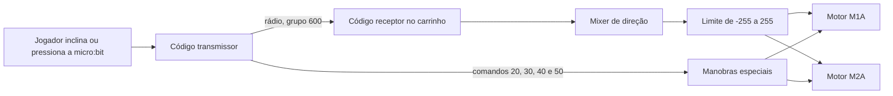

# Relatório técnico minucioso — seção Futebol de Robôs

## 1. Identificação do documento

- Projeto: portfólio profissional de David Santos Souza.
- Repositório local analisado: `portffolio-profissional`.
- Funcionalidade documentada: seção `ProjectRobotics`.
- Arquivo principal: `src/components/sections/ProjectRobotics.tsx`.
- Data desta documentação: 13 de julho de 2026.
- Público-alvo principal: outra IA ou pessoa desenvolvedora que precise compreender, testar, manter ou ampliar a implementação sem acessar a conversa que originou a tarefa.
- Idioma da interface e desta documentação: português do Brasil.
- Stack preservada: React 18, TypeScript, Vite, Tailwind CSS, Lucide React, Vitest e Testing Library.

## 2. Objetivo funcional solicitado

A solicitação consistiu em transformar um arquivo novo, porém ainda não funcional, em uma seção completa sobre um projeto educacional de futebol de robôs. A seção precisava:

1. apresentar o contexto do projeto;
2. explicar que existem duas placas micro:bit;
3. explicar que uma placa permanece no carrinho e recebe os comandos;
4. explicar que outra placa permanece na mão do jogador e envia os comandos;
5. dar destaque maior ao código receptor instalado no carrinho;
6. utilizar o link público do código receptor no Microsoft MakeCode;
7. utilizar o link público do código transmissor no Microsoft MakeCode;
8. apresentar o vídeo tutorial;
9. utilizar a imagem local fornecida como capa do vídeo;
10. integrar a seção à página inicial e à navegação;
11. manter responsividade, acessibilidade, tipagem e desempenho;
12. validar tudo com lint, testes, typecheck e build.

## 3. Estado encontrado antes da implementação

O arquivo encontrado no repositório se chamava `src/components/sections/ProjectRobotic.tsx`, no singular. O nome citado na solicitação era `ProjectRobotics.tsx`, no plural.

O conteúdo do arquivo encontrado não implementava robótica. Ele era uma cópia integral de `ProjectsSection.tsx`, contendo:

- importações da listagem geral de projetos;
- cards de projetos em destaque;
- laboratório de estudos;
- links para GitHub;
- nenhuma informação sobre micro:bit;
- nenhuma lógica para vídeo;
- nenhum link MakeCode;
- nenhuma integração com a página inicial.

A correção adotada foi:

1. remover o arquivo incorretamente nomeado `ProjectRobotic.tsx`;
2. criar `ProjectRobotics.tsx` com responsabilidade única;
3. importar e renderizar esse componente em `Index.tsx`;
4. adicionar `robotica` ao modelo tipado de navegação;
5. adicionar o item “Robótica” ao menu;
6. criar testes específicos.

## 4. Fontes factuais utilizadas

Os textos técnicos não foram inferidos apenas pela descrição do usuário. Os dois projetos públicos foram consultados por meio da API pública do MakeCode.

### 4.1 Código receptor — carrinho

- Link persistente: <https://makecode.microbit.org/S84234-74676-28856-20934>
- Nome publicado: `código recebe futebol`.
- Plataforma: Microsoft MakeCode for micro:bit.
- Editor preferencial: blocos, com representação equivalente em TypeScript/JavaScript.
- Extensão de motores: `github:kittenbot/pxt-robotbit#v0.4.8`.
- Arquivo lógico principal consultado: `main.ts`.

### 4.2 Código transmissor — controle do jogador

- Link persistente: <https://makecode.microbit.org/S49995-27738-16406-88213>
- Nome publicado: `código envia futebol`.
- Plataforma: Microsoft MakeCode for micro:bit.
- Editor preferencial: blocos, com representação equivalente em TypeScript/JavaScript.
- Arquivo lógico principal consultado: `main.ts`.

### 4.3 Tutorial

- Vídeo: <https://www.youtube.com/watch?v=WSEcYFiG8aA>
- Identificador do vídeo: `WSEcYFiG8aA`.
- Capa local: `src/assets/video-tutorial.webp`.
- Dimensões declaradas da imagem: 1920 × 1080.
- Tamanho observado do arquivo: aproximadamente 1,79 MB.

## 5. Arquitetura real do projeto de robótica

O projeto tem duas responsabilidades distribuídas entre duas placas.



### 5.1 Responsabilidade do transmissor

O transmissor:

1. configura o rádio no grupo `600`;
2. lê continuamente o acelerômetro nos eixos X e Y;
3. transforma a faixa física aproximada `-1024..1024` em faixas menores de comando;
4. mapeia Y para `-180..180`;
5. mapeia X para `-120..120`;
6. envia `y` e `x` como valores nomeados;
7. espera 50 ms antes da próxima transmissão;
8. envia números específicos quando botões ou o logotipo são pressionados.

### 5.2 Responsabilidade do receptor

O receptor:

1. configura o mesmo grupo de rádio `600`;
2. interrompe os motores ao iniciar;
3. recebe os valores nomeados `x` e `y`;
4. aplica uma zona morta de 15 unidades;
5. mistura aceleração e direção em dois valores independentes;
6. limita os valores para proteger a faixa aceita pelos motores;
7. envia os resultados aos motores M1A e M2A;
8. recebe comandos numéricos e executa manobras predefinidas.

## 6. Explicação matemática do carrinho

### 6.1 Zona morta

O receptor aplica a seguinte regra a cada eixo:

```ts
valorTratado = Math.abs(valorRecebido) < 15 ? 0 : valorRecebido;
```

Finalidade:

- acelerômetros raramente permanecem exatamente em zero;
- pequenas oscilações poderiam movimentar o robô sem intenção;
- qualquer valor entre `-14` e `14` é convertido para `0`;
- valores com módulo igual ou maior que `15` são mantidos.

### 6.2 Mixer diferencial

O código usa:

```ts
mDir = velocidadeY * -1 + velocidadeX;
mEsq = velocidadeY * -1 - velocidadeX;
```

Interpretação:

- `velocidadeY * -1` representa o componente de avanço ou recuo;
- `+ velocidadeX` altera o lado direito;
- `- velocidadeX` altera o lado esquerdo;
- velocidades iguais tendem a produzir deslocamento reto;
- velocidades diferentes produzem curva;
- sinais opostos podem produzir giro no próprio eixo.

### 6.3 Restrição da saída

Antes de chegar aos motores, cada valor passa por:

```ts
Math.constrain(valor, -255, 255)
```

Isso impede que a soma do mixer ultrapasse a faixa esperada pela extensão Robotbit.

## 7. Matriz dos comandos de rádio

| Entrada no controle | Número transmitido | Comportamento no carrinho |
|---|---:|---|
| Inclinação | valores nomeados `x` e `y` | Direção e velocidade contínuas pelos motores M1A e M2A. |
| Botão A | `30` | Dois motores em `200` por 100 ms, seguidos de parada. |
| Botão B | `40` | M1A em `-200` e M2A em `150` por 100 ms, seguidos de parada. |
| Botões A+B | `20` | Giro, curvas alternadas em “S”, quatro ciclos de shake e parada. |
| Toque no logotipo | `50` | Recuo em `-150`, pausa, avanço em `255` por 600 ms e parada. |

### 7.1 Sequência do comando 50 — chute

1. exibe ícone de preparação;
2. move os dois motores para trás com velocidade `-150`;
3. mantém o recuo por 200 ms;
4. interrompe os motores;
5. espera 200 ms para reduzir a troca brusca de sentido;
6. move os dois motores para frente em velocidade máxima `255`;
7. mantém o avanço por 600 ms;
8. interrompe os motores;
9. exibe um sinal na matriz de LEDs.

### 7.2 Sequência do comando 20 — comemoração

1. exibe um ícone;
2. aciona M1A em `220` e M2A em `-220` por 1000 ms;
3. aciona M1A em `200` e M2A em `50` por 400 ms;
4. inverte a intensidade da curva: M1A em `50` e M2A em `200` por 400 ms;
5. repete quatro vezes um movimento alternado com velocidades máximas e sinais opostos;
6. interrompe todos os motores.

## 8. Estrutura de arquivos após a implementação

```text
src/
├── assets/
│   └── video-tutorial.webp
├── components/
│   └── sections/
│       ├── ProjectRobotics.tsx
│       └── ProjectRobotics.test.tsx
├── data/
│   └── site.ts
├── pages/
│   └── Index.tsx
├── types/
│   └── portfolio.ts
└── App.test.tsx
```

## 9. Explicação linha por linha — `ProjectRobotics.tsx`

As linhas abaixo correspondem ao estado do arquivo no momento da criação deste relatório.

### 9.1 Linhas 1 a 5 — dependências

| Linha | Conteúdo/responsabilidade | Explicação para uma IA |
|---:|---|---|
| 1 | `useState` | Importa o hook que controla se o player já deve ser renderizado. Sem esse estado, o iframe seria carregado imediatamente. |
| 2 | `ReactNode` | Importação apenas de tipo. Define de forma segura o conteúdo aceito pelo componente auxiliar de link. Não gera JavaScript no bundle. |
| 3 | ícones Lucide | Importa somente os ícones utilizados: seta externa, robô, código, controle, play, rádio e energia. |
| 4 | `tutorialImage` | Faz o Vite processar a imagem WebP e devolver a URL final com hash no build. |
| 5 | `SectionHeading` | Reutiliza o cabeçalho padronizado das demais seções do portfólio. |

### 9.2 Linhas 7 a 10 — URLs constantes

| Linha | Constante | Explicação |
|---:|---|---|
| 7 | `receiverUrl` | Link persistente do código que fica no carrinho. É o CTA principal. |
| 8 | `transmitterUrl` | Link persistente do código que fica no controle do jogador. |
| 9 | `tutorialUrl` | Página normal do vídeo no YouTube, usada como alternativa externa. |
| 10 | `tutorialEmbedUrl` | URL do player incorporado. Usa `youtube-nocookie.com`, reprodução automática apenas após clique e `rel=0`. |

Separar URLs em constantes evita duplicação, facilita auditoria e reduz o risco de links divergentes.

### 9.3 Linhas 12 a 18 — dados dos comandos

| Linha | Explicação |
|---:|---|
| 12 | Inicia o array `receiverCommands`. |
| 13 | Documenta o fluxo contínuo X/Y. |
| 14 | Documenta o comando 30, associado ao botão A. |
| 15 | Documenta o comando 40, associado ao botão B. |
| 16 | Documenta o comando 20, associado a A+B. |
| 17 | Documenta o comando 50, associado ao logotipo e ao chute. |
| 18 | `as const` torna valores literais e somente leitura, evitando mutação acidental. |

Esses dados são separados da marcação JSX para permitir renderização declarativa com `map`.

### 9.4 Linhas 20 a 33 — componente `ExternalLink`

| Linha | Explicação |
|---:|---|
| 20 | Declara um componente interno reutilizável. Recebe `href`, `children` e a variante opcional `primary`. |
| 21 | Inicia o retorno JSX. |
| 22 | Cria um elemento semântico de link. |
| 23 | Associa o endereço recebido. |
| 24 | Abre recursos externos em nova aba. |
| 25 | Evita acesso à janela original e reduz risco de tabnabbing. |
| 26 | Aplica botão primário quando `primary=true`; caso contrário aplica botão secundário. |
| 27 | Fecha a abertura do elemento. |
| 28 | Renderiza texto e ícones fornecidos pelo chamador. |
| 29 | Adiciona indicação visual de abertura externa. O ícone é decorativo. |
| 30 | Adiciona “abre em nova aba” somente para tecnologias assistivas. |
| 31 | Fecha o link. |
| 32 | Fecha o retorno. |
| 33 | Fecha a função. |

### 9.5 Linhas 35 a 47 — componente principal e título

| Linha | Explicação |
|---:|---|
| 35 | Declara `ProjectRobotics`. Não recebe props porque os dados atuais são fixos e confirmados. |
| 36 | Cria o estado booleano `showVideo`, inicialmente `false`. |
| 38 | Inicia o retorno da interface. |
| 39 | Cria a seção semântica com ID navegável `robotica`; `aria-labelledby` liga a região ao título. |
| 40 | Aplica o container central e a largura máxima global. |
| 41 | Renderiza o cabeçalho reutilizável. |
| 42 | Define o ID real usado por `aria-labelledby`. |
| 43 | Define a categoria curta “Robótica educacional”. |
| 44 | Define a primeira parte do título. |
| 45 | Destaca “robôs” na cor principal. |
| 46 | Resume MakeCode, Robotbit, rádio e as duas micro:bits sem alegar resultados não comprovados. |
| 47 | Fecha o componente de cabeçalho. |

### 9.6 Linhas 49 a 63 — card principal do carrinho

| Linha | Explicação |
|---:|---|
| 49 | Cria grid de uma coluna por padrão e duas colunas em `lg`; o carrinho recebe 1,15 fração, o controle 0,85. |
| 50 | Abre o artigo principal com superfície visual compartilhada. |
| 51 | Alinha ícone e títulos. |
| 52 | Cria contêiner visual do ícone, oculto semanticamente. |
| 53 | Renderiza o ícone de robô. |
| 54 | Fecha o contêiner do ícone. |
| 55 | Agrupa categoria e título. |
| 56 | Identifica explicitamente o carrinho como código principal. |
| 57 | Cria o título do artigo com hierarquia `h3`. |
| 58–59 | Fecham grupos estruturais do cabeçalho do card. |
| 61 | Abre o parágrafo explicativo. |
| 62 | Explica onde o programa roda, o que recebe e o papel da extensão Robotbit. |
| 63 | Fecha o parágrafo. |

### 9.7 Linhas 65 a 75 — lógica de direção

| Linha | Explicação |
|---:|---|
| 65 | Abre uma caixa interna para destacar a lógica. |
| 66 | Usa `h4`, mantendo a hierarquia abaixo do `h3` do artigo. |
| 67 | Adiciona ícone decorativo e rótulo. |
| 68 | Fecha o título. |
| 69 | Cria lista ordenada, pois a transformação ocorre como sequência conceitual. |
| 70 | Explica a identificação dos nomes `x` e `y`. Elementos `code` diferenciam identificadores. |
| 71 | Explica exatamente a expressão `abs(value) < 15`. |
| 72 | Expõe as duas fórmulas reais do mixer. |
| 73 | Explica o `Math.constrain` e a faixa dos motores. |
| 74–75 | Fecham lista e caixa. |

### 9.8 Linhas 77 a 90 — tabela de comandos

| Linha | Explicação |
|---:|---|
| 77 | Contêiner arredondado com `overflow-hidden` para respeitar bordas. |
| 78 | Tabela ocupa toda a largura e usa colapso de bordas. |
| 79 | `caption` dá nome acessível e visível à tabela. |
| 80 | Cabeçalhos de coluna ficam visualmente ocultos, mas disponíveis a leitores de tela. |
| 81 | Abre o corpo da tabela. |
| 82 | Itera sobre `receiverCommands`. |
| 83 | Usa o comando como chave React estável e cria separação visual. |
| 84 | `th scope="row"` identifica semanticamente o comando de cada linha. |
| 85 | A célula de dados contém o comportamento correspondente. |
| 86–87 | Fecham linha e iteração. |
| 88–90 | Fecham corpo, tabela e contêiner. |

### 9.9 Linhas 92 a 95 — link do receptor

| Linha | Explicação |
|---:|---|
| 92 | Contêiner flexível permite quebra do botão em telas estreitas. |
| 93 | Usa o link principal, ícone decorativo e texto inequívoco “código do carrinho”. |
| 94 | Fecha o contêiner. |
| 95 | Fecha o artigo do receptor. |

### 9.10 Linhas 97 a 118 — transmissor

| Linha | Explicação |
|---:|---|
| 97 | Agrupa verticalmente card do transmissor e fluxo visual. |
| 98 | Abre o artigo secundário. |
| 99 | Alinha ícone e título. |
| 100–102 | Cria o ícone decorativo de controle. |
| 103 | Agrupa textos do cabeçalho. |
| 104 | Identifica “Código do jogador”. |
| 105 | Título `Transmissor`. |
| 106–107 | Fecham agrupamentos do cabeçalho. |
| 108 | Abre o texto técnico. |
| 109 | Documenta faixas X/Y e intervalo de 50 ms exatamente como no código MakeCode consultado. |
| 110 | Fecha o parágrafo. |
| 111 | Abre lista de características. |
| 112 | Registra que ambos usam grupo 600. |
| 113 | Relaciona controles físicos aos números enviados. |
| 114 | Fecha a lista. |
| 115 | Abre o contêiner do CTA. |
| 116 | Link secundário para o código transmissor. |
| 117–118 | Fecham contêiner e artigo. |

### 9.11 Linhas 120 a 130 — fluxo da comunicação

| Linha | Explicação |
|---:|---|
| 120 | Usa `aside` porque o diagrama complementa os dois artigos; liga-o a um título próprio. |
| 121 | Cria o título com ID `fluxo-title`. |
| 122 | Cria grid de três colunas: origem, seta e destino. |
| 123 | Representa visualmente o controle. |
| 124 | Usa a seta rotacionada como indicação decorativa de fluxo. |
| 125 | Representa visualmente o carrinho. |
| 126 | Fecha o grid. |
| 127 | Descreve o mesmo fluxo em texto; isso evita depender apenas do desenho. |
| 128–130 | Fecham `aside`, coluna secundária e grid principal. |

### 9.12 Linhas 132 a 143 — player após ativação

| Linha | Explicação |
|---:|---|
| 132 | Cria artigo do tutorial e associa seu título por `aria-labelledby`. |
| 133 | Em telas grandes, distribui mídia e texto nas proporções 1,35/0,65. |
| 134 | Reserva proporção 16:9 e posicionamento relativo. |
| 135 | Inicia renderização condicional com base em `showVideo`. |
| 136 | Renderiza iframe somente se o usuário já ativou o vídeo. |
| 137 | Usa a URL `youtube-nocookie`. |
| 138 | Fornece título obrigatório e descritivo ao iframe. |
| 139 | Faz o player preencher o contêiner. |
| 140 | Autoriza apenas recursos necessários ao player. |
| 141 | Usa política de referência restritiva. |
| 142 | Permite modo de tela cheia. |
| 143 | Fecha o iframe. |

### 9.13 Linhas 144 a 165 — capa e botão de reprodução

| Linha | Explicação |
|---:|---|
| 144 | Define o ramo executado antes do clique. |
| 145 | Renderiza um botão real, operável por teclado. |
| 146 | `type="button"` impede comportamento acidental de envio caso o componente seja movido para perto de formulário. |
| 147 | No clique, altera `showVideo` para `true`. |
| 148 | Faz o botão preencher a mídia e mantém anel de foco dentro dos limites. |
| 149 | Define nome acessível independente da imagem. |
| 150 | Fecha a abertura do botão. |
| 151 | Renderiza a capa fornecida. |
| 152 | Usa o asset importado pelo Vite. |
| 153 | Texto alternativo descreve a função visual da imagem. |
| 154 | Carregamento preguiçoso reduz prioridade inicial da imagem. |
| 155 | Decodificação assíncrona reduz bloqueio de renderização. |
| 156–157 | Dimensões intrínsecas preservam proporção e evitam mudança de layout. |
| 158 | Preenche o quadro; o zoom só ocorre quando movimento é permitido. |
| 159 | Fecha a imagem. |
| 160 | Adiciona camada de contraste; é decorativa. |
| 161 | Cria círculo central laranja para o botão de play; animação condicionada a movimento permitido. |
| 162 | Ícone de play preenchido. |
| 163 | Fecha o círculo. |
| 164 | Fecha o botão. |
| 165 | Fecha a condição. |

### 9.14 Linhas 166 a 182 — texto final e exportação

| Linha | Explicação |
|---:|---|
| 166 | Fecha a área de mídia. |
| 167 | Cria a coluna textual centralizada verticalmente. |
| 168 | Rótulo “Vídeo tutorial”. |
| 169 | Título do artigo com o ID usado em `aria-labelledby`. |
| 170 | Descreve o conteúdo esperado do vídeo. |
| 171 | Contêiner do link alternativo. |
| 172 | Link externo para assistir diretamente no YouTube. |
| 173–178 | Fecham contêineres, artigo, container e seção. |
| 179 | Fecha o retorno JSX. |
| 180 | Fecha a função. |
| 182 | Exporta o componente como padrão para importação em `Index.tsx`. |

## 10. Explicação linha por linha — integração em `Index.tsx`

Somente as linhas relevantes à funcionalidade nova são destacadas, mas o contexto completo é descrito.

| Linha | Explicação |
|---:|---|
| 1–6 | Importam layout e seções anteriores. |
| 7 | Importa `ProjectRobotics` pelo alias `@`, resolvido para `src`. |
| 8–9 | Importam projetos gerais e metadados. |
| 11 | Declara a página inicial. |
| 12–16 | Configura title, description e canonical da página. |
| 19 | Mantém altura mínima e fundo global. |
| 20 | Link de salto para acessibilidade por teclado. |
| 21 | Renderiza o cabeçalho fixo. |
| 22 | Abre o conteúdo principal focável. |
| 23–25 | Renderiza apresentação, sobre e experiência. |
| 26 | Renderiza a listagem geral de projetos. |
| 27 | Renderiza a nova seção detalhada de robótica logo depois dos projetos. |
| 28 | Mantém contato depois da nova seção. |
| 29–31 | Fecham conteúdo, rodapé e página. |
| 35 | Exporta a página. |

A ordem escolhida foi `Projetos → Robótica → Contato` porque robótica é um estudo de caso e deve aparecer antes da conversão final de contato.

## 11. Explicação linha por linha — navegação em `site.ts`

| Linha | Explicação |
|---:|---|
| 1 | Importa os contratos de configuração e navegação. |
| 3–13 | Mantém dados profissionais já existentes. |
| 15 | Abre a lista central de navegação reutilizada no header e footer. |
| 16 | Item Sobre. |
| 17 | Item Experiência. |
| 18 | Item Projetos. |
| 19 | Novo item `robotica`, cujo valor deve coincidir exatamente com `id="robotica"` da seção. |
| 20 | Item Contato. |
| 21 | `satisfies readonly NavigationItem[]` valida todos os IDs e rótulos sem perder tipos literais. |

Consequências da linha 19:

- o header desktop ganha “Robótica”;
- o menu móvel ganha “Robótica”;
- o footer ganha “Robótica”;
- `useActiveSection` passa a observar a seção;
- o link ativo pode receber `aria-current="location"`.

## 12. Explicação linha por linha — tipo em `portfolio.ts`

| Linha | Explicação |
|---:|---|
| 15 | O union type `NavigationSectionId` recebeu o literal `"robotica"`. |
| 17–20 | `NavigationItem.id` depende desse union; por isso o novo literal era obrigatório para o TypeScript aceitar o item de menu. |

Sem alterar a linha 15, o typecheck retorna:

```text
Type '"robotica"' is not assignable to type 'NavigationSectionId'.
```

Essa falha foi realmente encontrada na primeira execução e corrigida no modelo, não contornada com `as any`.

## 13. Explicação linha por linha — teste `ProjectRobotics.test.tsx`

### 13.1 Linhas 1 a 4

| Linha | Explicação |
|---:|---|
| 1 | Importa renderização e consultas acessíveis. |
| 2 | Importa simulador de interação realista do usuário. |
| 3 | Importa API do Vitest. |
| 4 | Importa o componente sob teste. |

### 13.2 Linhas 6 a 20 — conteúdo inicial

| Linha | Explicação |
|---:|---|
| 6 | Agrupa os testes do componente. |
| 7 | Nomeia o caso de renderização inicial. |
| 8 | Monta a seção no JSDOM. |
| 10 | Confirma que o título acessível existe. |
| 11–14 | Confirma texto acessível e URL exata do código receptor. |
| 15–18 | Confirma texto acessível e URL exata do código transmissor. |
| 19 | Confirma que a imagem de capa está disponível antes do player. |
| 20 | Fecha o teste. |

### 13.3 Linhas 22 a 33 — carregamento sob demanda

| Linha | Explicação |
|---:|---|
| 22 | Inicia teste assíncrono de interação. |
| 23 | Cria uma instância do `userEvent`. |
| 24 | Renderiza a seção. |
| 26 | Garante que nenhum iframe existe antes da ação. |
| 27 | Clica no botão usando seu nome acessível. |
| 29–32 | Confirma que o iframe apareceu com a URL exata de incorporação. |
| 33–34 | Fecham teste e suíte. |

O teste não depende de classes CSS, o que o torna mais resistente a mudanças puramente visuais.

## 14. Alteração no teste integrado `App.test.tsx`

A linha 18 verifica:

```ts
expect(screen.getByRole("heading", { name: /futebol de robôs/i })).toBeInTheDocument();
```

Essa asserção prova que:

1. `Index.tsx` realmente importa o componente;
2. a seção é renderizada pela aplicação completa;
3. o título permanece acessível;
4. uma remoção acidental da seção fará o teste integrado falhar.

## 15. Dependências visuais reutilizadas de `index.css`

Nenhuma folha CSS exclusiva foi criada. A seção reutiliza o design system existente.

| Regra | Linha aproximada | Uso |
|---|---:|---|
| `:focus-visible` | 64 | Anel de foco global para links e botão do vídeo. |
| `.section-spacing` | 70 | Espaçamento vertical consistente. |
| `.card-surface` | 84 | Fundo, borda, raio e sombra dos artigos. |
| `.project-link` | 129 | CTA primário e base dos links. |
| `.project-link-secondary` | 133 | Variante secundária. |
| `prefers-reduced-motion` | 212 | Reduz animações e transições conforme preferência do sistema. |

Classes Tailwind importantes utilizadas:

- `scroll-mt-24`: impede que o header fixo cubra o início da seção ao navegar por âncora;
- `bg-surface/40`: diferencia a seção das vizinhas sem criar um novo tema;
- `lg:grid-cols-[1.15fr_0.85fr]`: dá maior espaço ao código do carrinho;
- `flex-wrap`: permite que botões quebrem sem overflow;
- `aspect-video`: reserva proporção 16:9;
- `motion-safe:*`: só aplica zoom quando animações não foram reduzidas;
- `sr-only`: fornece informação sem adicionar ruído visual;
- `text-muted-foreground`: mantém hierarquia de contraste do projeto.

## 16. Acessibilidade implementada

### 16.1 Estrutura semântica

- a funcionalidade é uma `<section>`;
- a seção possui nome acessível por `aria-labelledby`;
- receptor e transmissor são `<article>`;
- o fluxo complementar é `<aside>`;
- o tutorial também é um `<article>`;
- os níveis de título seguem `h2` no `SectionHeading`, `h3` nos artigos e `h4` no detalhe interno;
- os comandos usam uma tabela real, não uma grade de `div`.

### 16.2 Links externos

- todos abrem em nova aba;
- todos usam `rel="noopener noreferrer"`;
- todos recebem indicação textual para leitor de tela;
- os textos distinguem carrinho, controle e YouTube.

### 16.3 Mídia

- a capa tem texto alternativo;
- o botão tem `aria-label` próprio;
- o iframe tem `title` descritivo;
- o vídeo pode ser aberto diretamente no YouTube;
- o player permite tela cheia.

### 16.4 Informação não dependente de cor ou ícone

- ícones decorativos usam `aria-hidden`;
- os nomes “Controle” e “Carrinho” aparecem em texto;
- o fluxo é repetido em um parágrafo;
- comandos e comportamentos são escritos, não representados apenas por cores.

### 16.5 Movimento reduzido

O zoom da capa e do botão usa `motion-safe`. A folha global também reduz duração de animações quando `prefers-reduced-motion: reduce` está ativo.

## 17. Desempenho e privacidade

### 17.1 Estratégia adotada para o vídeo

O iframe não existe no HTML inicial. Isso evita, antes do consentimento implícito do clique:

- download do player do YouTube;
- execução de scripts do player;
- conexões adicionais;
- custo de CPU e memória;
- parte do rastreamento associado à incorporação.

Somente após `setShowVideo(true)` o React substitui o botão/capa pelo iframe.

### 17.2 Domínio de incorporação

Foi usado `youtube-nocookie.com`, que é a variante de privacidade aprimorada para vídeos incorporados.

### 17.3 Imagem

A capa usa:

- `loading="lazy"`;
- `decoding="async"`;
- `width="1920"`;
- `height="1080"`;
- formato WebP.

Observação para uma futura IA: o arquivo tem aproximadamente 1,79 MB. Ele funciona corretamente, mas pode ser otimizado para uma largura compatível com o layout, mantendo aparência e formato. Não substituir ou recomprimir sem comparar visualmente o resultado e sem preservar o asset original quando necessário.

## 18. Segurança

- nenhum HTML externo é injetado com `dangerouslySetInnerHTML`;
- nenhum código MakeCode é executado dentro do portfólio;
- os projetos MakeCode são apenas links;
- o iframe aponta para uma URL constante, não para entrada do usuário;
- links externos usam `noopener noreferrer`;
- o iframe usa `referrerPolicy="strict-origin-when-cross-origin"`;
- não há token, chave ou segredo no componente;
- não há armazenamento local ou cookie criado pela seção.

## 19. Responsividade

### 19.1 Celular

- o layout principal usa uma coluna;
- receptor, transmissor e tutorial ficam empilhados;
- a tabela mantém duas colunas e quebra textos internamente;
- botões podem quebrar linha;
- a imagem continua em 16:9;
- não existe overflow horizontal em 320 px.

### 19.2 Desktop

- receptor e transmissor ficam lado a lado;
- o receptor recebe a maior coluna para reforçar sua prioridade;
- transmissor e fluxo ficam empilhados na coluna direita;
- tutorial usa mídia larga à esquerda e texto à direita;
- não existe overflow horizontal em 1440 px.

### 19.3 Validação visual executada

Um navegador Chromium/Edge headless abriu o build real e verificou:

| Viewport | Seção encontrada | Imagem encontrada | Links MakeCode | Overflow horizontal | Player após clique |
|---:|---:|---:|---:|---:|---:|
| 320 × 800 | 1 | 1 | 2 | não | sim |
| 1440 × 900 | 1 | 1 | 2 | não | sim |

## 20. Validações automatizadas executadas

Comando principal:

```powershell
node C:\nvm4w\nodejs\node_modules\npm\bin\npm-cli.js run check
```

O script `check` executa, nesta ordem:

1. ESLint com zero warnings permitidos;
2. Vitest em modo de execução única;
3. TypeScript do aplicativo sem emitir arquivos;
4. TypeScript da configuração Node sem emitir arquivos;
5. build do Vite.

Resultado obtido:

```text
Test Files  4 passed (4)
Tests       13 passed (13)
TypeScript  aprovado
ESLint      aprovado, zero warnings
Vite build  aprovado
```

O build transformou 1607 módulos e gerou os bundles de produção corretamente.

## 21. Build limpo

Como builds sucessivos poderiam manter assets antigos no diretório local, o procedimento final foi:

1. resolver o caminho absoluto de `dist`;
2. confirmar que o caminho estava dentro do workspace;
3. remover apenas `dist`;
4. executar `npm run build` novamente;
5. confirmar a geração do asset `video-tutorial` com hash;
6. confirmar a geração de um único CSS e um único JavaScript atuais.

O diretório final possuía 24 arquivos após o build limpo.

## 22. Decisões de implementação e justificativas

### 22.1 Por que criar uma seção própria?

O conteúdo é mais detalhado que um card de portfólio. Ele possui arquitetura, tabela, dois códigos e vídeo. Colocá-lo dentro de um card existente reduziria legibilidade e misturaria responsabilidades.

### 22.2 Por que o receptor ocupa mais espaço?

A solicitação determinou foco principal no código do carrinho. A proporção `1.15fr/0.85fr` e o conteúdo mais extenso tornam essa prioridade visível.

### 22.3 Por que não incorporar o MakeCode em iframe?

- o requisito era disponibilizar os links;
- dois editores incorporados seriam pesados;
- o editor MakeCode possui interface complexa em telas pequenas;
- links persistentes permitem abrir, simular, copiar e editar no ambiente adequado;
- a seção permanece rápida e legível.

### 22.4 Por que usar tabela para comandos?

Existe uma relação exata e repetida entre entrada e resultado. Tabela é semanticamente melhor para essa comparação e facilita leitura por pessoas e IAs.

### 22.5 Por que não mostrar todo o JavaScript na página?

- o código completo é longo;
- o MakeCode já oferece blocos e JavaScript sincronizados;
- a página deve explicar a lógica, não duplicar o editor;
- o link leva à fonte completa;
- fórmulas e números essenciais foram mantidos na interface.

## 23. Contratos que uma futura IA deve preservar

Uma IA que modificar a seção deve manter, salvo nova instrução explícita:

1. `id="robotica"` igual ao ID em `navigation`;
2. `robotica` dentro de `NavigationSectionId`;
3. link receptor `S84234-74676-28856-20934`;
4. link transmissor `S49995-27738-16406-88213`;
5. vídeo `WSEcYFiG8aA`;
6. imagem `src/assets/video-tutorial.webp`;
7. receptor visualmente prioritário;
8. grupo de rádio `600`, enquanto os códigos públicos permanecerem assim;
9. comandos `20`, `30`, `40` e `50` conforme os códigos públicos;
10. carregamento do iframe somente após interação;
11. link direto alternativo para o YouTube;
12. segurança de links externos;
13. nomes acessíveis para botões, links, tabela e iframe;
14. testes específicos e integrados.

## 24. Procedimento recomendado para futuras alterações

### 24.1 Antes de editar

1. abrir os dois links MakeCode;
2. verificar se o grupo de rádio mudou;
3. verificar se botões e comandos mudaram;
4. verificar se faixas do acelerômetro mudaram;
5. verificar se tempos e velocidades das manobras mudaram;
6. comparar com a tabela e os textos do componente;
7. preservar mudanças não relacionadas existentes no worktree.

### 24.2 Durante a edição

1. editar com TypeScript estrito;
2. não usar `any` para contornar tipos;
3. manter elementos semânticos;
4. manter foco visível;
5. evitar adicionar dependência apenas para uma interação simples;
6. manter links em constantes;
7. atualizar `receiverCommands` se a lógica mudar;
8. atualizar testes junto com a implementação.

### 24.3 Depois da edição

Executar:

```powershell
npm run lint
npm run test
npm run typecheck
npm run build
```

Ou executar tudo:

```powershell
npm run check
```

Depois:

1. testar 320 px;
2. testar 375 px;
3. testar 768 px;
4. testar 1440 px;
5. navegar por teclado;
6. ativar o vídeo;
7. abrir cada link;
8. verificar console do navegador;
9. verificar overflow horizontal;
10. conferir comportamento com movimento reduzido.

## 25. Possíveis evoluções, sem implementação automática

Estas são oportunidades, não pendências obrigatórias:

1. otimizar a capa WebP para reduzir os atuais 1,79 MB;
2. criar uma rota dedicada para o estudo de caso se o conteúdo crescer muito;
3. incluir fotos confirmadas do carrinho e do controle;
4. adicionar diagrama elétrico, caso exista material oficial;
5. apresentar trechos reais de TypeScript em um acordeão acessível;
6. adicionar data, instituição, autoria e resultados somente após confirmação;
7. criar JSON-LD do tipo `CreativeWork` ou `LearningResource` caso a seção ganhe URL própria;
8. testar com ferramenta automatizada de acessibilidade no navegador real.

Não inventar:

- métricas de desempenho do robô;
- colocação em competição;
- número de alunos;
- autoria coletiva ou institucional;
- hardware além do confirmado;
- resultados pedagógicos não documentados.

## 26. Checklist final do estado documentado

- [x] Arquivo com nome correto `ProjectRobotics.tsx`.
- [x] Arquivo duplicado incorreto removido.
- [x] Componente integrado à página inicial.
- [x] Item Robótica integrado ao menu desktop.
- [x] Item Robótica integrado ao menu móvel.
- [x] Item Robótica integrado ao rodapé.
- [x] Tipo de navegação atualizado.
- [x] Código receptor destacado.
- [x] Código transmissor explicado.
- [x] Grupo de rádio documentado.
- [x] Zona morta documentada.
- [x] Mixer documentado.
- [x] Limite dos motores documentado.
- [x] Comandos numéricos documentados.
- [x] Link receptor inserido.
- [x] Link transmissor inserido.
- [x] Imagem local inserida.
- [x] Vídeo incorporado sob demanda.
- [x] Link direto para YouTube inserido.
- [x] Estrutura semântica aplicada.
- [x] Navegação por teclado preservada.
- [x] Movimento reduzido respeitado.
- [x] Teste unitário da seção criado.
- [x] Teste integrado atualizado.
- [x] 13 testes aprovados.
- [x] ESLint aprovado.
- [x] TypeScript aprovado.
- [x] Build aprovado.
- [x] Build final limpo.
- [x] Responsividade verificada em 320 e 1440 px.
- [x] Ausência de overflow horizontal confirmada.

## 27. Resumo operacional para outra IA

Se uma IA receber somente este documento, deve entender que `ProjectRobotics.tsx` é uma seção React controlada por um único estado booleano. Antes do clique, ela mostra uma imagem WebP dentro de um botão acessível. Depois do clique, substitui essa capa por um iframe do YouTube com privacidade aprimorada. A seção apresenta dois programas MakeCode: o transmissor lê acelerômetro e botões; o receptor mistura coordenadas, limita velocidades e movimenta dois motores Robotbit. O componente está inserido após `ProjectsSection` e antes de `ContactSection`. O ID `robotica` é um contrato compartilhado entre JSX, dados de navegação e tipos TypeScript. Qualquer alteração nos códigos MakeCode deve gerar atualização coordenada dos textos, da matriz de comandos e dos testes.

Este relatório descreve o estado validado da implementação e deve ser atualizado se links, códigos, arquitetura, comandos, testes ou posição da seção forem modificados.
